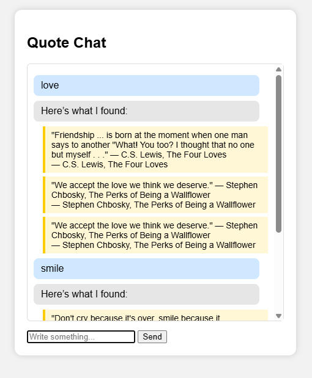
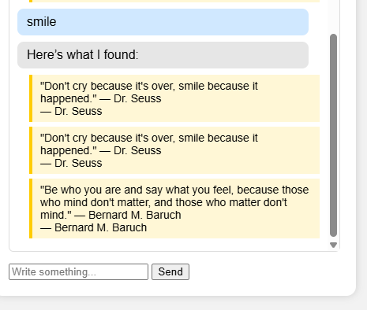
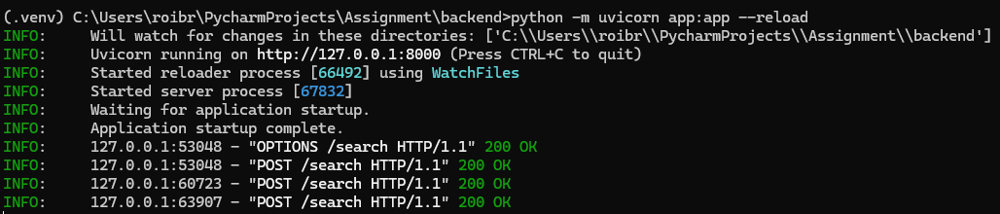

# Quote Semantic Search Application  

This project is a simple full-stack app that retrieves semantically similar quotes using vector embeddings, ChromaDB, and a FastAPI backend.  
I selected a quotes dataset because it's small, clear, and works perfectly for semantic similarity tasks.  
For efficiency, I used only a reduced subset (about 70 quotes).

---

## Demonstration

### **Frontend Web Interface**




### **Swagger API Test**


### **Server Running (CMD Output)**


---

# 1. Project Overview

This project implements a semantic quote search engine.  
The user types any concept (like *love* or *friendship*), and the system returns the closest quotes based on meaning instead of exact keyword matching.

The system includes:

- **FastAPI backend**
- **ChromaDB** as a local vector database
- **OpenAI text-embedding-3-small**
- **Simple HTML/JS/CSS frontend**

---

### Backend Files Overview

- **app.py** – Runs the FastAPI server, receives a user query, performs semantic search using ChromaDB, and returns the most relevant quotes.
- **ingest.py** – Loads the quotes dataset, generates embeddings for each quote, and stores them in ChromaDB for fast similarity search.
- **data/quotes.json** – The original dataset containing the selected quotes.
- **chroma/** – The local vector database created automatically after running the ingest script.
- **requirements.txt** – Contains all required Python dependencies.
- **.env** – Stores the API key for OpenAI embeddings (kept out of Git for security).
  
---

# 2. Motivation

## 2.1 Why this dataset?
- Easy to understand  
- Lightweight  
- Perfect for demonstrating semantic search  
- Allows quick embedding + storage  

## 2.2 Why ChromaDB?
- Built for vector search  
- Fast similarity queries  
- Works locally (PersistentClient)  
- Very easy to use with Python  
- Fits the assignment goals perfectly  

## 2.3 Why OpenAI embeddings?
- High-quality semantic vectors  
- Works smoothly with ChromaDB  
- Good for small projects  

## 2.4 Why FastAPI + simple frontend?
- FastAPI gives Swagger UI automatically  
- Easy JSON API  
- Simple HTML/JS is enough for the UI  

---

# 3. System Architecture

User Input → Frontend (JS Fetch) → FastAPI `/search` → ChromaDB similarity search → return top 3 quotes → display on page

---

# 4. Project Structure

```
Assignment/
│── README.md
│
├── backend/
│   ├── app.py
│   ├── ingest.py
│   ├── data/quotes.json
│   ├── chroma/
│   └── .env
│
└── frontend/
    ├── index.html
    ├── app.js
    └── style.css
```

---

# 5. Installation & Running

## Step 1 — Create virtual environment
```
python -m venv .venv
```

## Step 2 — Activate (Windows)
```
.\.venv\Scripts\activate
```

## Step 3 — Install backend requirements
```
pip install -r backend/requirements.txt
```

## Step 4 — Add `.env` file
Put inside `backend/.env`:
```
CHROMA_OPENAI_API_KEY=...
```

---

# 6. Ingest Dataset into ChromaDB

From backend folder:
```
python ingest.py
```

Expected:
```
Ingested 70 quotes into Chroma collection 'quotes'
```

---

# 7. Run the FastAPI server

```
python -m uvicorn app:app --reload
```

Swagger UI:
```
http://127.0.0.1:8000/docs
```

---

# 8. Run the Frontend

Open:
```
frontend/index.html
```

---

# 9. API Documentation

### POST /search
Request:
```json
{
  "query": "love"
}
```

Response:
```json
{
  "results": [
    {
      "quote": "...",
      "metadata": {...},
      "score": 0.64
    }
  ]
}
```

---

# 10. Conclusion

This project demonstrates:
- Data ingestion  
- Embedding creation  
- Vector database usage  
- Semantic similarity search  
- A working frontend + backend setup  

All components work together to form a complete quote-retrieval system.


